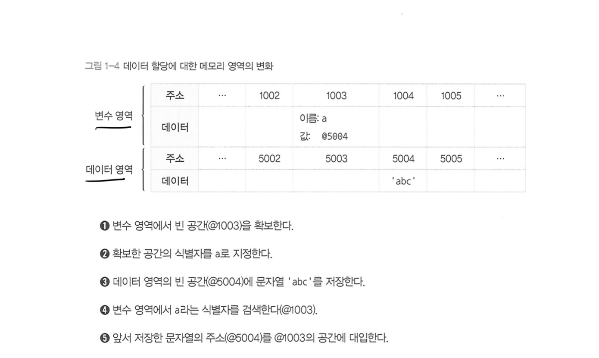
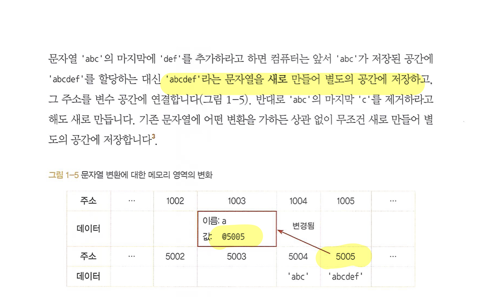
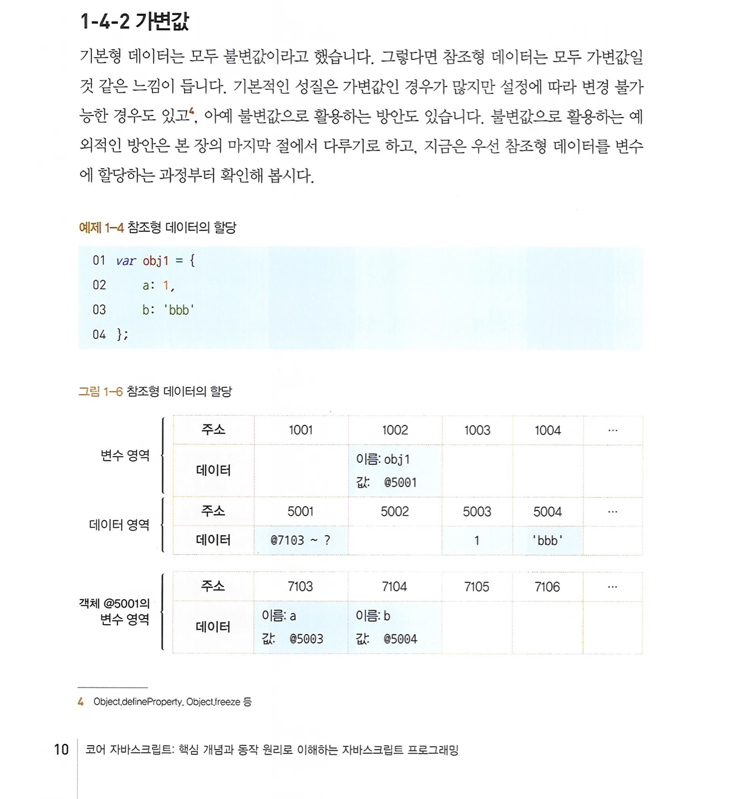
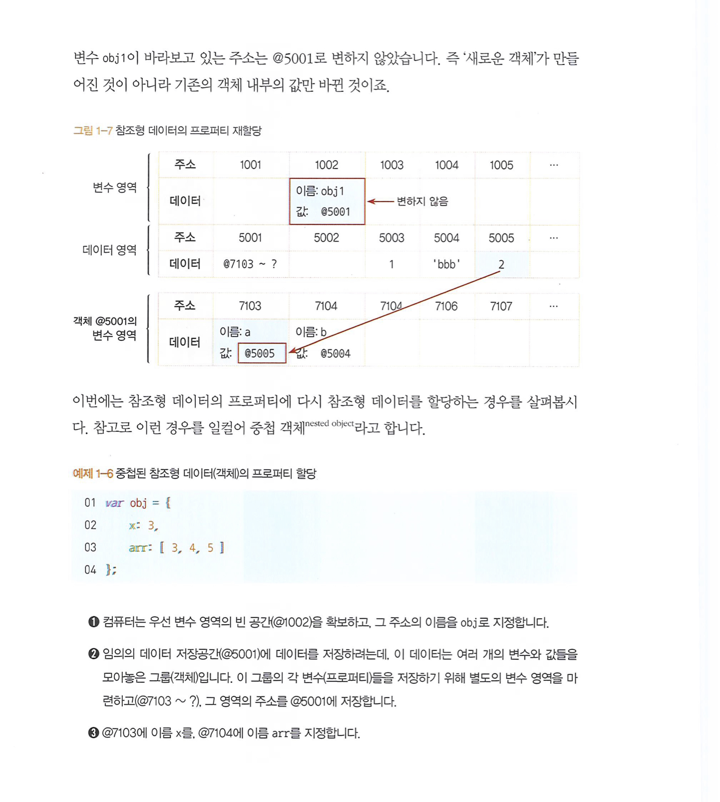
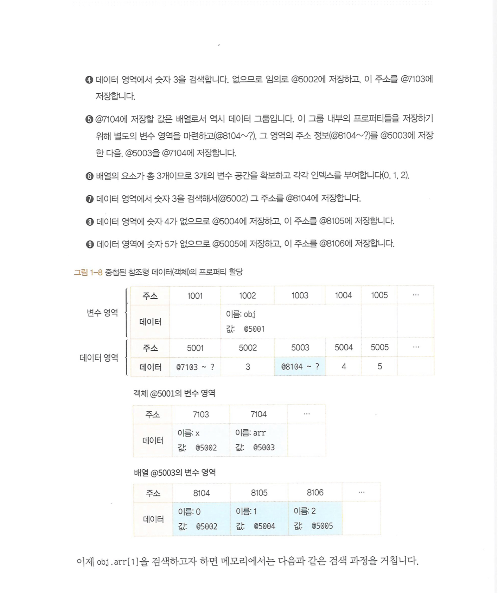
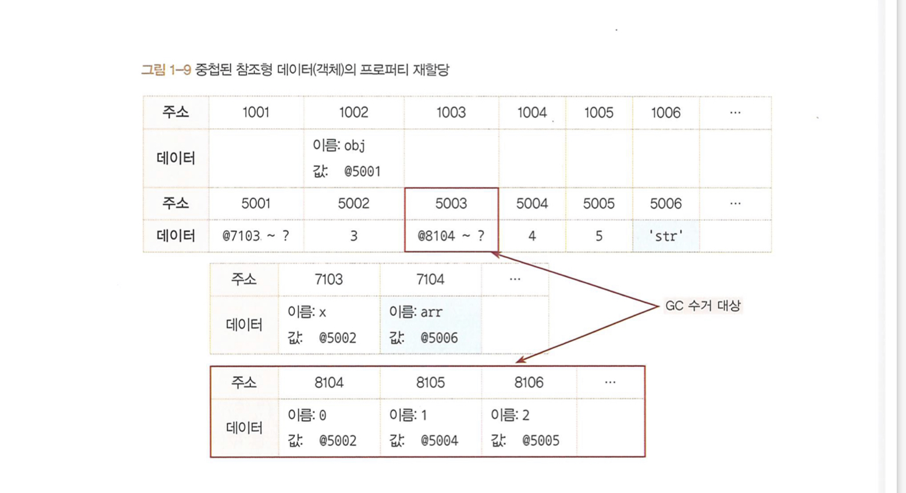
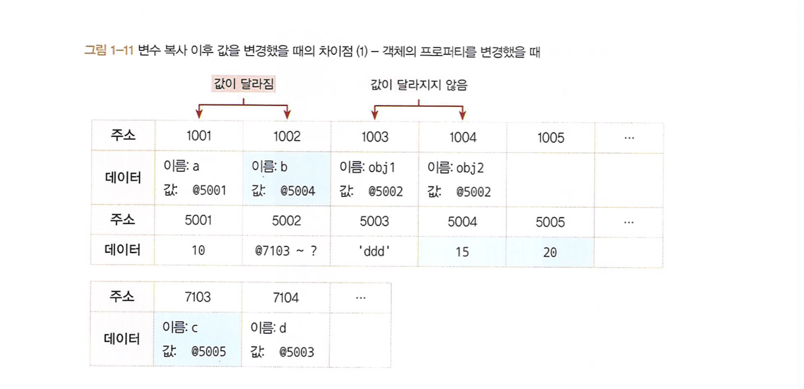

- 기본형은 값이 담긴 주솟값을 바로 복제하는 반면 참조형은 값이 담긴 주솟값들로 이루어진 묶음을 가리키는 주솟값을 복제한다는 점이 다르다.

## 식별자와 변수

- 보통 변수(variable)와 식별자(identifier)를 혼용하는 경우가 많지만 둘의 차이를 명확히 알고 있어야한다.

### 변수

- `변할 수 있는 수`. 수학 용어를 차용했기 때문에 숫자를 의미하는 '수'가 붙었을 뿐, 값이 반드시 '숫자'여야 하는 것은 아니다. 영어단 variable은 원래 `변할 수 있다`라는 형용사이지만 컴퓨터 용어로 쓸 때는 **변할 수 있는 무언가**라는 명사로 확장 시킴
- 여기서 '무언가'란 **데이터**를 말한다. 숫자, 문자열, 객체, 배열 모두 데이터다.

### 식별자

- 어떤 데이터를 식별하는데 사용하는 이름, **즉 변수명**

## 변수 선언과 데이터 할당

- 변수선언의 동작원리를 알아보자

- 데이터의 성질에 따라 `변수 영역`, `데이터 영역`으로 구분하여 이해하면 좋다. (정식 명칭은 아니다)

### 왜 변수 영역에 값을 직접 대입하지 않고 한 단계를 거쳐 데이터를 저장할까?

- 데이터의 변환을 자유롭게 할 수 있게 함과 동시에 메모리를 더욱 효율적으로 관리하기 위한 고민의 결과이다.
- 만약 미리 확보된 공간 내에서만 데이터를 변환을 할 수 있다면 변환한 데이터를 다시 저장하기 위해서는 `확보된 공간을 변환된 데이터 크기에 맞게 늘리는 작업`이 선행돼야 한다.
  - 해당 공간이 메모리상의 가장 마지막에 있었다면, 뒤쪽만 늘리면 되지만 중간에 있는 경우는 복잡한 작업을 수행해야한다.
  - 메모리 값을 참조하기 때문에 변수 영역과 데이터 영역을 분리하면 중복된 데이터에 대한 처리 효율이 높아진다.

## 기본형 데이터와 참조형 데이터

### 불변값

- 변수(variable)와 상수(constant)를 구분하는 성질은 `변경 가능성`이다. 바꿀 수 있으면 변수, 바꿀 수 없으면 상수이다.
- **불변값과 상수를 같은 개념으로 오해하기 쉬운데, 이둘을 명확히 구분할 필요가 있다.**
  - 변수와 상수를 구분 짓는 변경 가능성의 대상은 `변수 영역` 메모리이다. 한 번 데이터 할당이 이뤄진 변수 공간에 다른 데이터를 재할당할 수 있는지 여부가 관건이다.
  - 불변성 여부를 구분할 때의 변경 가능성의 대상은 `데이터 영역` 메모리이다.

### GC(가비지 컬렉터)

- 런타임 환경에 따라 특정 시점이나 메모리 사용량이 포화 상태에 임박할 떄마다 자동으로 수거 대상들을 수거한다.
- 어떤 데이터에 대해 자신의 주소를 참조하는 변수의 개수를 참조 카운트라고 한다.
- 참조 카운트가 `0`인 메모리 주소는 가비지 컬렉터의 수거 대상이 된다.

## 기본/참조형 변수 복사 비교

- 변수를 복사하는 과정은 기본형 데이터와 참조형 데이터 모두 같은 주소를 바라보게 되는 점에서 동일합니다. 하지만 데이터 할당 과정에서 차이가 있기 떄문에 변수 복사 이후의 동작에도 큰 차이가 발생합니다.

- `기본형은 값을 복사하고 참조형은 주솟값을 복사한다`고 설명하고 있지만, 사실은 어떤 데이터 타입이든 변수에 할당하기 위해서는 주솟값을 복사해야 하기 떄문에, 엄밀히 따지면 **자바스크립트의 모든 데이터 타입은 참조형 데이터**일 수밖에 없습니다.

| 기본형 | 참조형 |
|-----|-----|
| 주솟값 복사 1번  | 주솟값 복사 n번  |
