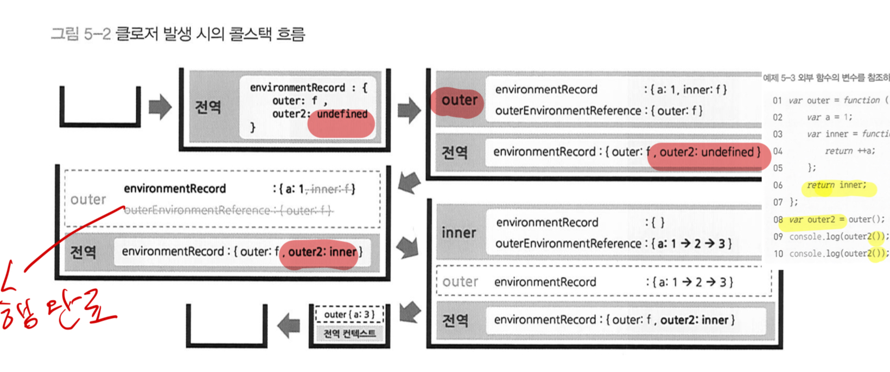

## 01. 클로저의 의미 및 원리 이해

- 클로저는(Closure)는 여러 함수형 프로그래밍 언어에서 등장하는 보편적인 특성이다. 다만 다양한 문헌에서 제각각 클로저를 다르게 정의 또는 설명하고 있다. 더구나 클로저를 설명하는 문장 자체도 이해하기 어려운 단어가 등장하는 경우가 많다. 다양한 서적에서 클로저를 한 문장으로 요약해서 설명하는 부분들을 소개하면 다음과 같다.


- [MDN closure](https://developer.mozilla.org/ko/docs/Web/JavaScript/Closures)에서는 `클로저는 함수와 그 함수가 선언될 당시의 lexical environment의 상호관계에 따른 현상`이라 규정하고 있다.
- `LexicalEnviroment`의 `enviromentRecode`와 `outerEnviromentReference`에 의해 변수의 유효범위인 스코프가 결정되고 스코프 체인이 가능해진다.
  - 어떤 컨텍스트 A에서 선언한 내부함수 B의 실행 컨텍스트가 활성화된 시점에는 B의 `outerEnviromentReference`가 참조하는 대상인 A의 `LexicalEnviroment` 에도 접근이 가능하다. A에서는 B에서 선언한 변수에 접근할 수 없지만 B에서는 A에서 선언한 변수에 접근 가능하다.
- 내부함수 B가 A의 `LexicalEnviroment`를 언제나 사용하는것은 아니지만, 내부함수에서 외부 변수를 참조하는 경우에 한해서만 combination, 즉 `선언될 당시의 lexical environment의 상호관계`가 의미가 있다.`

```javascript
//외부 함수의 변수를 참조하는 내부 함수
var outer = function () {
  var a = 1;
  var inner = function () {
    return ++a;
  };
  return inner; //fn자체를 return
};

var outer2 = outer();

console.log(outer2()); //2
console.log(outer2()); //3
```

- 위 코드에선 `inner`함수의 실행 결과가 아닌 **`inner`함수 자체를 반환했다.** 해당 함수를 담고 아래 `console.log`에서 `inner`함수를 실행 시점에는 `outer` 함수는 이미 실행이 종료된 상태인데 어떻게 `LexicalEnviroment` 접근할 수 있는걸까?
  - 어떤 함수의 `LexicalEnviroment`가 이를 참조할 예정인 다른 실행 컨텍스트가 있는 한 실행 종료 이후에도 GC(가비지컬렉터)되지 않는다.
  - 위 코드예제는 언젠가 `inner` 함수의 실행 컨텍스트가 활성화되면 `outerEnviromentReference`가 `outer` 함수의 `LexicalEnviroment`를 필요로 할 것이므로 수집대상에서 제외된다.

  

### 클로저를 나타내는 가장 근접한 표현


- 주의 할 점은 `외부의 전달`이 곧 `return`만을 의미하지 않는다.

```javascript
// (1) setInterval/setTimeout
(function () {
  var a = 0;
  var intervalId = null;
  var inner = function () {
    if (++a >= 10) {
      clearInterval(intervalId);
    }
    console.log(a);
  };
  intervalId = setInterval(inner, 1000);
})();
```

- (1)은 별도의 외부객체인 window의 메서드(setTimeout 또는 setInterval)에 전달할 콜백 함수 내부에서 지역변수를 참조한다. 지역변수를 참조하는 내부함수를 외부에 전달했기 떄문에 클로저이다.

## 02. 클로저와 메모리 관리

- 메모리 소모는 클로저의 본질적은 특성이다.
- `메모리 누수`라는 표현은 개발자의 의도와 달리 어떤 값의 참조 카운트가 0이 되지 않아 GC의 수거 대상이 되지 않는 경우에는 맞는 표현이지만, 개발자가 의도적으로 참조 카운트를 0이 되지 않게 설계한 경우는 `누수`라 할 수 없다.

### 메모리 관리 방법

- 클로저는 어떤 필요에 의해 의도적으로 함수의 지역변수 메모리를 소모하도록 함으로써 발생한다. 그렇다면 필요성이 사라진 시점에는 메모리를 소모하지 않게 참조 카운트를 0 으로 만들어주면 GC가 수거해 갈 것 이다.
- 참조 카운트를 0으로 만드는 방법은 식별자에 참조형이 아닌 기본형 데이터 `null`이나 `undefined`를 할당하면 된다.

[예제코드 넣기]()

## 03. 클로저의 활용 사례